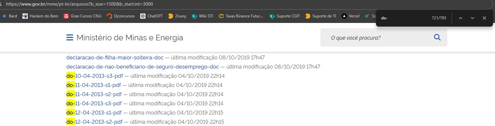

# Gerador de PDF LGPD

## Descrição

O **Gerador de PDF LGPD** é um automatizador que cria documentos PDF personalizados, cada um contendo um link único direcionado para uma data específica do Diário Oficial da União. Esses documentos são utilizados para substituir arquivos localizados em [Ministério de Minas e Energia](https://www.gov.br/mme/pt-br/arquivos) (documentos do dou) nas respectivas datas.

## Clonagem do Repositório

Antes de começar, clone o repositório para sua máquina local. Utilize o seguinte comando:

```bash
git clone https://github.com/seu-usuario/seu-repositorio.git
```
## Instalação

1. **Pré-requisitos:** Certifique-se de que você tem o Python instalado em sua máquina.
2. **Instale a biblioteca `fpdf`:**
    ```bash
    pip install fpdf
    ```

## Uso

Apesar de ser um código automatizado, ele funciona como um loop e um gerador de PDFs, onde o usuário precisa ajustar as informações da data que deseja gerar. Siga os passos abaixo para utilizar o programa:

1. **Alteração da Data:**  
   Para gerar PDFs de um mês e ano específicos, edite as linhas `24`, `26`, e `27` do código para refletir a data desejada.  
   **Exemplo:** Para gerar PDFs de julho de 2015, utilize a seguinte configuração:
    ```python
    link = f'https://www.in.gov.br/leiturajornal?data={i:02d}-07-2015'
    nome_pdf = f"do-{i:02d}-07-2015"
    pdf.output(f"./julho-2015/{nome_pdf}.pdf")
    ```

2. **Criação de Diretório:**  
   Antes de executar o código, crie uma pasta no mesmo diretório do projeto seguindo o padrão `mes-ano`.  
   **Exemplo:** Para julho de 2015, crie uma pasta chamada `julho-2015`. Esta pasta será utilizada para armazenar os PDFs gerados.

3. **Execução do Código:**  
   Após as alterações, execute o script para gerar os PDFs. Eles serão salvos automaticamente na pasta especificada.

## Exemplo de Código

```python
from fpdf import FPDF

class PDF(FPDF):
    def header(self):
        pass  

for i in range(1, 31):
    pdf = PDF()  # Cria uma nova instância do PDF para cada iteração
    pdf.add_page()

    # Adiciona uma imagem no corpo do documento
    pdf.image('./logo.png', x=15, y=20, w=180)

    pdf.set_font("Arial", "B", 25)
    pdf.set_y(150)  # Ajusta a posição vertical para abaixo da imagem
    pdf.cell(0, 10, "Para acessar documento", ln=True, align="C")

    pdf.set_font("Arial", size=25)
    pdf.set_text_color(0, 0, 255)

    # Adiciona o texto do link centralizado horizontalmente
    pdf.set_y(170)  # Ajusta a posição vertical para onde o link será inserido
    link = f'https://www.in.gov.br/leiturajornal?data={i:02d}-07-2015'
    pdf.cell(0, 10, 'Clique aqui', ln=True, align='C', link=link)
    nome_pdf = f"do-{i:02d}-07-2015"
    pdf.output(f"./julho-2015/{nome_pdf}.pdf")
    print(f"PDF gerado: {nome_pdf}.pdf")
```
## Tarefa: Substituição de Arquivos do Diário Oficial da União (DOU) em Respeito à LGPD

Como parte do cumprimento da nova Lei Geral de Proteção de Dados (LGPD), é necessário substituir arquivos do Diário Oficial da União (DOU) na página do Ministério de Minas e Energia. O processo envolve a substituição de arquivos antigos por novos PDFs gerados conforme as datas especificadas.

### Instruções

1. **Listar Arquivos no DOU:**

   Para melhorar a eficácia na busca dos arquivos, utilize a URL abaixo para listar até 1500 arquivos por página. O padrão é listar apenas 20 arquivos por página, o que pode ser muito pouco considerando que existem mais de 25 mil arquivos.

   **URL para listar 1500 arquivos por página:**
   [https://www.gov.br/mme/pt-br/arquivos?b_size=1500&b_start:int=3000](https://www.gov.br/mme/pt-br/arquivos?b_size=1500&b_start:int=3000)

   - `b_size` define a quantidade de arquivos exibidos por página.
   - `b_start:int` define o ponto de início para a listagem de arquivos.

   Após acessar a URL, utilize `Ctrl + F` para procurar pelos arquivos do DOU com o padrão de nome "do-00-0000".

   

2. **Substituição dos Arquivos:**

   Substitua cada arquivo listado pelo novo PDF gerado pelo **Gerador de PDF LGPD**. Certifique-se de que as datas dos arquivos substituídos correspondem às datas dos PDFs gerados.
